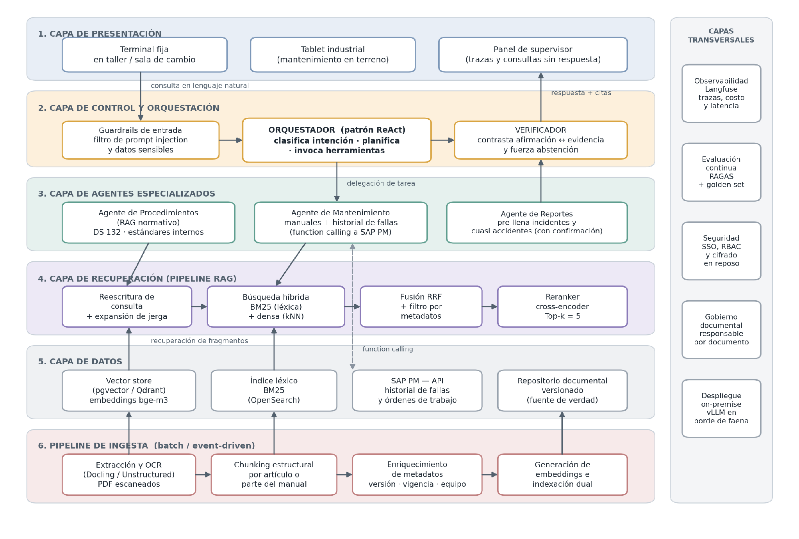
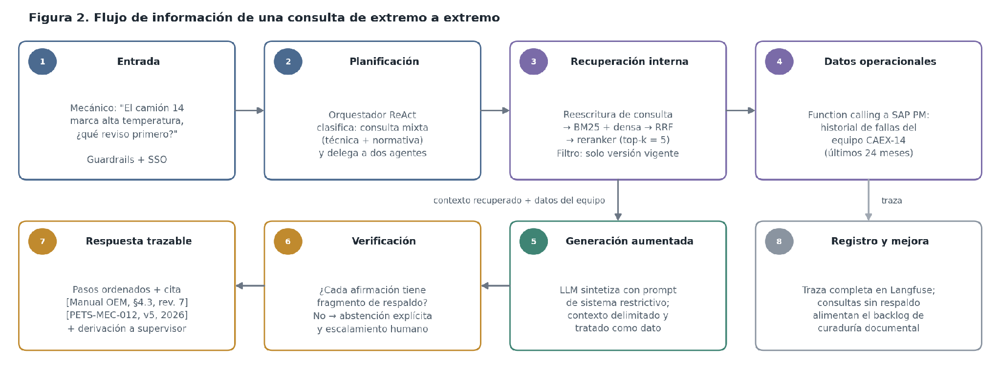

# Asistente de Faena — LLM + RAG + agentes

Prototipo académico para **ISY0101 Ingeniería de Soluciones con IA** (Evaluación Parcial N°1).
Caso: **Codelco, División Chuquicamata**. La documentación de seguridad y mantenimiento existe, pero cuesta encontrarla a tiempo.

El asistente responde consultas en lenguaje natural sobre procedimientos (PETS), normativa (DS 132), manuales de fabricantes en inglés e historial de fallas (SAP PM), bajo tres reglas:

1. **Toda respuesta cita su fuente**: `[documento | sección | revisión | vigencia]`.
2. **Se abstiene cuando no tiene respaldo** y deriva a una persona.
3. **La decisión queda en manos de una persona**: el asistente no autoriza intervenciones.

> ⚠️ El corpus, los usuarios y la base de SAP PM son **simulados**. Ningún documento es real ni pertenece a Codelco.

---

## Ejecución rápida

Requisitos: Python 3.10 o superior. Ollama es opcional, pero recomendado.

```powershell
# 1. Entorno e instalación
python -m venv .venv
.venv\Scripts\activate
pip install -r requirements.txt
pip install -e .

# 2. (Opcional, recomendado) modelos locales con Ollama
ollama pull bge-m3          # embeddings multilingües (~1,2 GB)
ollama pull qwen3.5:0.8b    # generador pequeño; puede reemplazarse por uno mayor

# 3. Construir el índice (se hace solo la primera vez que se consulta)
python -m asistente.ingesta

# 4. Usar el asistente
streamlit run app.py                                     # interfaz web (demo)
python -m asistente.cli --detalle                        # chat por terminal
python -m asistente.cli --pregunta "El camión 14 marca alta temperatura. ¿Qué reviso primero?" --detalle

# 5. Pruebas y evaluación
pytest -v                            # pruebas automatizadas
python eval/evaluar.py --offline     # métricas sobre el conjunto dorado (sin LLM)
python eval/evaluar.py               # métricas con el LLM local
```

Sin Ollama, el sistema funciona igual en **modo offline**: usa un embedder de respaldo y un generador extractivo que responde con oraciones literales de los documentos.

### Variables de entorno

| Variable | Valor por defecto | Uso |
|---|---|---|
| `MODO_LLM` | `auto` | `ollama`, `offline` o `auto` (usa Ollama si el modelo está disponible) |
| `MODO_EMBEDDINGS` | `auto` | `ollama`, `hashing` o `auto` |
| `MODELO_GENERADOR` | `qwen3.5:0.8b` | Modelo de Ollama para generar |
| `MODELO_EMBEDDINGS` | `bge-m3` | Modelo de Ollama para embeddings |
| `UMBRAL_ABSTENCION` | `0.30` | Puntaje mínimo del mejor fragmento para responder |
| `VERIFICADOR_LLM` | (vacío) | `1` agrega el veredicto del LLM al verificador determinista |

Usuarios de prueba (SSO simulado): `tok-mecanico-mina`, `tok-supervisor` y `tok-contratista`.

---

## Arquitectura



Flujo de una consulta (Figura 2 del informe):



El grafo del orquestador está implementado en LangGraph ([src/asistente/grafo.py](src/asistente/grafo.py)):

```
entrada → reescritura → clasificación ─┬─> reporte (borrador; registra solo con confirmación)
                                       └─> recuperación ─[umbral + respondibilidad]─┬─> abstención
                                                                                    └─> generación → verificación ─┬─> respuesta
                                                                                                                   ├─> reintento extractivo
                                                                                                                   └─> abstención
```

### Cinco agentes

| Agente | Qué hace | Archivo |
|---|---|---|
| Orquestador | Clasifica la intención (procedimientos, mantenimiento, mixta o reporte), delega y controla los reintentos | `grafo.py`, `agentes.py` |
| Procedimientos | RAG normativo: PETS, DS 132, hojas de seguridad e incidentes | `agentes.py` |
| Mantenimiento | Manuales OEM y boletines, más el historial exacto de SAP PM por *function calling* | `agentes.py`, `herramientas.py` |
| Reportes | Pre-llena el reporte de incidente; registra solo si el usuario confirma (RF-05) | `agentes.py`, `herramientas.py` |
| Verificador | Revisa afirmación por afirmación: cita válida y contenido presente en el fragmento citado | `verificador.py` |

### Prototipo frente a producción

| Componente | Producción (informe) | Prototipo (este repositorio) |
|---|---|---|
| Orquestación | LangGraph | LangGraph ✔ |
| Generador | LLM abierto de 70B con vLLM on-premise | LLM pequeño local con Ollama, o generador extractivo |
| Embeddings | bge-m3 | bge-m3 vía Ollama ✔ (respaldo: n-gramas) |
| Índice léxico | OpenSearch (BM25) | `rank-bm25` en memoria |
| Índice vectorial | pgvector | matriz NumPy en disco |
| Reranker | bge-reranker-v2-m3 | Combinación de similitud semántica, cobertura de términos y prioridad |
| Herramientas | Servidor MCP sobre la API de SAP PM | Funciones con autorización + servidor MCP opcional (`mcp_servidor.py`) sobre SAP simulado |
| Extracción | Docling con OCR | Markdown con metadatos (corpus simulado) |
| Observabilidad | Langfuse | Trazas JSONL en `trazas/` + panel de supervisor |
| Evaluación | RAGAS con 250 preguntas | Métricas propias inspiradas en RAGAS con 26 preguntas |

---

## Cómo se cumple cada requerimiento

| Requerimiento | Implementación | Prueba |
|---|---|---|
| RF-01 / RF-02 Consultas normativas y manuales en inglés | Recuperación híbrida y bilingüe; glosario ES→EN | `test_busqueda_bilingue_encuentra_manual_en_ingles` |
| RF-03 Historial por equipo | `consultar_historial` (datos exactos, no vectorizados) | `test_ejemplo_camion_14` |
| RF-04 Cita en cada respuesta | Plantilla de cita + verificador | `test_verificador_*` |
| RF-05 Reportes con confirmación | `registrar_reporte(confirmado=...)` | `test_reporte_no_se_registra_sin_confirmacion` |
| RF-06 Abstención y escalamiento | Umbral + respondibilidad + verificador | `test_se_abstiene_sin_respaldo` |
| RNF-04 Solo documentos vigentes | Filtro de metadatos antes de buscar | `test_nunca_usa_revisiones_superadas` |
| RNF-05 Permisos por rol | Autorización en la herramienta, no en el prompt | `test_contratista_no_ve_historial`, `test_mecanico_no_ve_equipos_de_otra_area` |
| RNF-06 Trazabilidad | `trazas.py` + panel de supervisor | — |
| OWASP LLM01 Inyección | Saneamiento al indexar + guardrail de entrada + regla 7 del prompt | `test_no_obedece_orden_escondida` |

---

## Estructura

```
├── app.py                    Interfaz web (Streamlit): chat + panel de supervisor
├── src/asistente/
│   ├── config.py             Parámetros (umbral, top-k, modelos)
│   ├── prompts.py            Prompts de sistema, plantilla y verificador (reglas R1–R8)
│   ├── ingesta.py            Chunking estructural, metadatos, indexación dual
│   ├── recuperacion.py       BM25 + densa → RRF → rerank → umbral
│   ├── contexto.py           Memoria de sesión y reescritura de la consulta
│   ├── agentes.py            Clasificación, generación, respondibilidad, reportes
│   ├── verificador.py        Verificación afirmación por afirmación
│   ├── herramientas.py       SAP PM y reportes con autorización por token
│   ├── guardrails.py         Inyección de prompt y datos personales
│   ├── grafo.py              Orquestador en LangGraph
│   ├── trazas.py             Trazabilidad
│   ├── llm.py / embeddings.py
│   ├── mcp_servidor.py       Servidor MCP opcional
│   └── cli.py                Chat por terminal
├── data/corpus/interna|externa   Corpus simulado (con metadatos YAML)
├── data/sap_pm_mock.json         SAP PM simulado
├── data/usuarios.json            Usuarios y roles simulados
├── eval/                         Conjunto dorado y script de métricas
├── tests/                        Pruebas automatizadas
├── evidencias/                   Resultados de pruebas y evaluación
├── docs/                         Diagramas y bocetos
├── informe/                      Informe técnico
└── presentacion/                 Presentación de la defensa
```

## Resultados

Ver [evidencias/](evidencias/). Se actualizan al ejecutar `pytest` y `eval/evaluar.py`.

## Limitaciones

- Corpus reducido y simulado; el umbral de abstención está calibrado sobre él y debe recalibrarse con el corpus real.
- El generador pequeño que corre en un equipo con 6 GB de RAM traduce y redacta peor que un modelo de 70B. Por eso el verificador y el reintento extractivo son obligatorios.
- La clasificación de intención y la reescritura de consultas son por reglas (auditables); en producción pueden apoyarse en un LLM ligero.
- El verificador determinista mide respaldo léxico o semántico, no la verdad del contenido.

## Uso de IA en el desarrollo

*(Completar por el equipo según https://bibliotecas.duoc.cl/ia: qué herramienta, para qué parte y cómo se validó.)*
